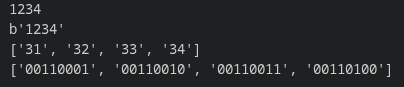
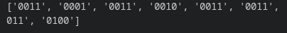
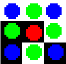

# flower code(f-code)
Программа переводящая любой текст в визуальный код. Алгоритм занимаеться маппингов битов для каждого слова без использования кодировок слов или символов. В слова входят любые символы входимые в кодировку utf-8. В рамках программы используется только кодировка символов от 0x00 до 0xff.


# Алгоритм f-code
## Процесс переводов слова
Здесь мы просто вродим процесс перевода полученного текста сначала в utf-8 после происходит переход в шестнадцатиричную систему, и после в бинарную. Для примера работы алгоритма все пункты будут использовать 1 вход "1234"


## Деление сдвоенных букв
Разбиваем 8-битные букв на пару 4-битных


## Построение базового холста
для построения холста нужно расчитать размерность холста и для этого используеться формула
$$
size = ceil(sqrt(len(word))) * 3 + 6
$$

Более обощёный формат
$$
size = ceil(sqrt(len(word))) * pixels_flower_size + spase * 2
$$

Далле в матрице нулей расставляются якорные точки. Относительно них бы будет производить запись символов слова. На рисунке они отмечены красными точками


## Постоение цветка
Само построение цветка немного сложное. Так как каждый из символов представляет собой пару четырёх битных цифр, то мы производим запись их по отдельности. Для простоты вопсриятия отметим их синим и зелёным цветом, где синий это первые 4 бита, а зелёный вторые 4 бита. 

Рассмотрим запись на примере "1". После прохождения пуктов 1 и 2 мы получаем пару "0011" "0001". Запись первого набора битов начинаете с верхневого левого угла и по часовой стрелке, а вторые 4 бита начинают записываться с верха относительно якоря и дальше по часовой стрелке.



После записи всех букв мы получим следующую картику


## Добавление позицианирующих символов
На этом шаге можно эксперементировать как угодно для этого есть отступ от краев в 3 пикселя (это было учтено в расчете размера в виде +6). Было решено просто добавить уголки, начинающиеся от середины и заканчивающиеся в округленным вверх логарифме с основание 2 от размера. 

итогом стал этот f-code


# Код не для предложений длинной не целого корня
Большинство предложение не имеют длинну по символам такую же, как и целые корни. По этому у нас остаются якоря без цветков из-за чего возникают вопросы это символ или нет. Для решения этой проблемы надо использовать не базовую матрицу 0, а базовую матрицу с фоном из 2. Тогда мы сможем отличить, когда якорь около пустоты, и их заменяем на 0. Дальше есть 2 пути либо заменить все двойки на 0, либо при прокраске равен ли значение 1 и остальное красить в белый. 

# Colorful flower code (CF-code)
Далее расмотрим цветной варинат. Здесь фактически все тоже самое, но для отметки цветов используеться следующее определние по числам:

0 - фон

1 - якорь

2 - значние 0 у лепестков, касающихся якоря. (выше отмечены зеленым цветом)

3 - значение зависящее от положения. Если 3 касаеться 1, то это значени 1 у лепестка, касающегося якоря(зеленые), если же 3 не касаеться 1(находиться на углу), то это значени 0 у лепестков на углу(синие)

4 - значение 1 у лепестков, не касающихся якоря (выше отмечены синим цветом)

Производим построение цветков и определяем набор из 5 цветов для каждого из цифр. Также для покраски используеться переодическая инверсия, чтобы набор одинаковых значение не смешивались в кашу.

Для позиционирования используються уголки в нижнем левом и верхнем правом углу


# Инструкция по запуску
После копирования репозитория в директорию и входа в venv установите зависимоти:
```
pip install pillow
```
## Для запуска F-code 
Запустите файл
```
python main_bnw.py
```
пишите ваше предложение
## Для запуска CF-code 
Запустите файл
```
python main.py
```
пишите ваше предложение